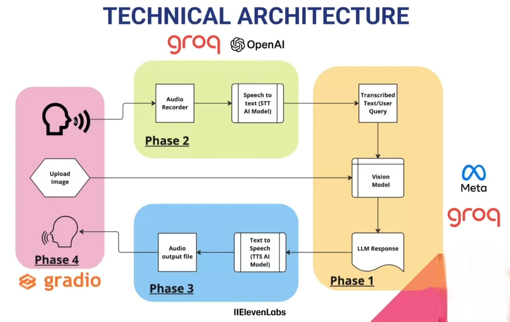

# MedSpeak - The AI Doctor with Vision and Voice

MedSpeak is an AI-powered multimodal medical chatbot that seamlessly analyzes images and voice inputs to provide accurate health insights. By simply uploading a photo of a medical condition and describing it through your voice, MedSpeak delivers expert advice through both voice and text, offering step-by-step guidance for effective care.




## Project Layout

The project is divided into four phases:

### **Phase 1 - Setup the Brain of the Doctor (Multimodal LLM)**

- Setup **GROQ API key**.
- Convert images to the required format.
- Configure **Multimodal LLM** to process text, audio, and images.

---

### **Phase 2 - Setup the Voice of the Patient**

- Configure **Audio Recorder** (using ffmpeg & portaudio).
- Setup **Speech-to-Text (STT) Model** for transcription.
- Utilize **OpenAI Whisper**, a state-of-the-art open-source model, via **GROQ** for transcription.


---

### **Phase 3 - Setup the Voice of the Doctor**

- Configure **Text-to-Speech (TTS) Model** using **gTTS & ElevenLabs**.
- Convert AI-generated text responses into realistic voice output.

---

### **Phase 4 - Setup UI for the VoiceBot**

- Build a **VoiceBot UI using Gradio**.
- Provide a user-friendly interface for voice-based interactions.

---

## Tools and Technologies Used

- **Groq** - AI inference engine.
- **OpenAI Whisper** - Best open-source model for speech-to-text transcription.
- **Llama 3 Vision** - Open-source vision model by Meta.
- **gTTS & ElevenLabs** - Text-to-speech conversion.
- **Gradio** - UI development framework.
- **Python** - Core programming language.
- **VS Code** - Development environment.

## How to Run the Project

1. Clone the repository:
   ```bash
   git clone [https://github.com/your-username/MedSpeak.git](https://github.com/Raghu-Yadav/MedSpeak-AI-VoiceBot.git)
   cd MedSpeak_AI_Doctor
   ```
2. Install dependencies:
   ```bash
   pip install -r requirements.txt
   ```
3. Set up API keys for **GROQ, OpenAI Whisper, and ElevenLabs**.
4. Run the application:
   ```bash
   python gradio_app.py
   ```
5. Access the UI via the **Gradio interface**.

---

🚀 **MedSpeak - The Future of AI-Powered Healthcare!**
